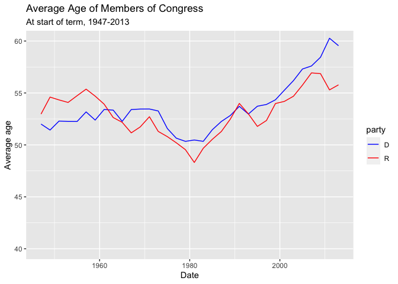

Untitled
================

## GitHub Documents

This is an R Markdown format used for publishing markdown documents to
GitHub. When you click the **Knit** button all R code chunks are run and
a markdown file (.md) suitable for publishing to GitHub is generated.

## Including Code

You can include R code in the document as follows:

``` r
library(ggplot2)
library(dplyr)
```

    ## 
    ## Attaching package: 'dplyr'

    ## The following objects are masked from 'package:stats':
    ## 
    ##     filter, lag

    ## The following objects are masked from 'package:base':
    ## 
    ##     intersect, setdiff, setequal, union

``` r
library(fivethirtyeight)
# For reading CSV spreadsheet files:
library(readr)
avg_congress_age <- congress_age %>% 
  group_by(termstart,party) %>% 
  summarise(mean_age=mean(age,na.rm = TRUE)) %>% 
  filter(party == "D"| party == "R")
```

    ## `summarise()` has grouped output by 'termstart'. You can override using the `.groups` argument.

## Including Plots

You can also embed plots, for example:

<!-- -->

Note that the `echo = FALSE` parameter was added to the code chunk to
prevent printing of the R code that generated the plot.
